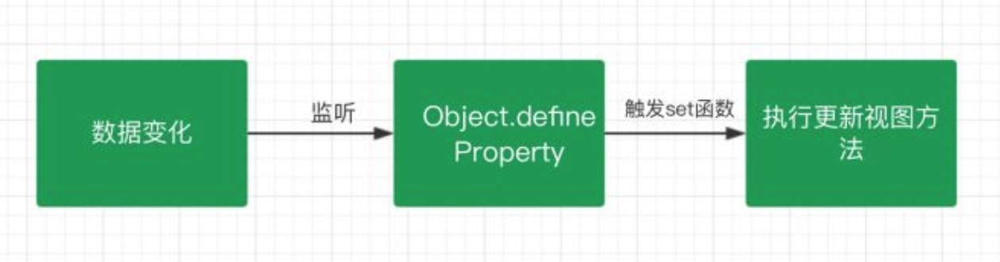
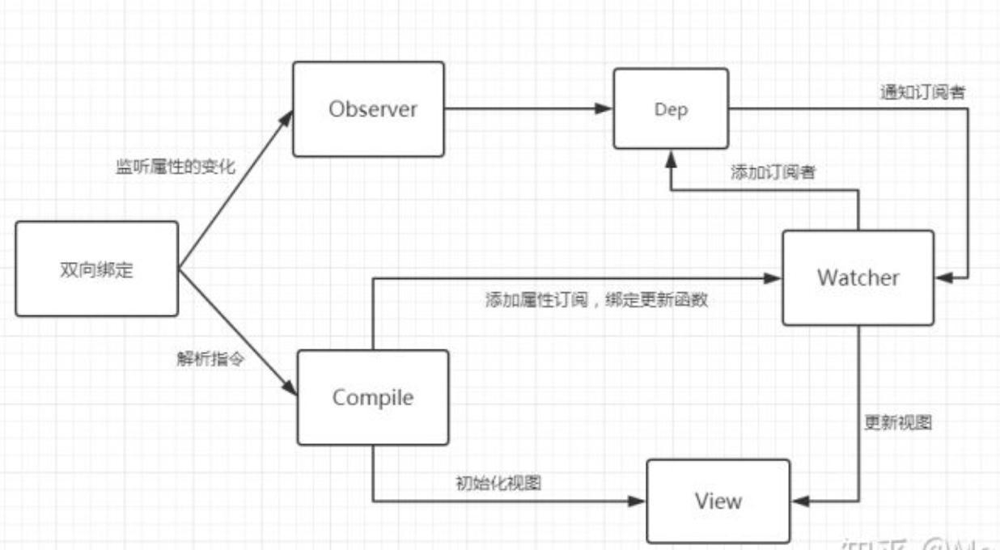

# Vue双向绑定原理，教你一步一步实现双向绑定

此教程非原创，只是为了录教学视频整理的，文章来源：https://zhuanlan.zhihu.com/p/47541415

## 〇、数据绑定
在开始之前我们先来说说数据绑定是什么，数据绑定我的理解就是让数据M（model）展示到 视图V（view）上。目前大概有三种实现方式：
- 发布订阅模式
  - 一般通过sub, pub的方式实现数据和视图的绑定监听，更新数据方式通常做法是 vm.set('property', value)，这种方式现在毕竟太low了，我们更希望通过 vm.property = value 这种方式更新数据，同时自动更新视图
- Angular 的脏查机制
  - angular.js 是通过脏值检测的方式比对数据是否有变更，来决定是否更新视图
  - DOM事件，譬如用户输入文本，点击按钮等。( ng-click )
  - XHR响应事件 ( $http )
  - 浏览器Location变更事件 ( $location )
  - Timer事件( $timeout , $interval )
  - 执行 $digest() 或 $apply()
- 数据劫持
  - vue.js 是采用数据劫持结合发布者-订阅者模式的方式，通过Object.defineProperty()来劫持各个属性的setter，getter，在数据变动时发布消息给订阅者，触发相应的监听回调。
  
### Object.defineProperty
我们不详细讨论 Object.defineProperty 的用法，我们主要看看它的存储属性 get 与 set。我们来看看通过它设置的对象属性之后有何变化。
```js
var people = {
    name: "Lukin",
    age: 18
}
people.age; //18
people.age = 20;
```
上述代码就是普通的获取/设置对象的属性
```js
var people = {}
var age;
Object.defineProperty(people, 'age', {
  get: function () {
    console.log("获取年龄");
    return age;
  },
  set: function (newVal) {
    console.log("设置年龄");
    age = newVal;
  }
});
people.age = 18;
console.log(people.age);
```
你会发现通过上述操作之后，我们访问 age 属性时会自动执行 get 函数，设置 age 属性时，会自动执行 set 函数，这就给我们的双向绑定提供了非常大的方便。

## 一、思路整理

我们要实现的功能是：数据与视图保持同步，意思是说数据改变时会自动更新视图，视图发生变化时会更新数据。

所以我们需要做的就是如何检测到数据的变化然后通知我们去更新视图，如何检测到视图的变化然后去更新数据。检测视图这个比较简单，无非就是我们利用事件的监听即可。

那么如何才能知道数据属性发生变化呢？这个就是利用我们上面说到的 Object.defineProperty 当我们的属性发生变化时，它会自动触发 set 函数从而能够通知我们去更新视图。



## 二、代码实现
通过上面的描述与分析我们知道 Vue 是通过数据劫持结合发布订阅模式来实现双向绑定的。我们也知道数据劫持是通过 Object.defineProperty 方法，当我们知道这些之后，我们就需要一个监听器 Observer 来监听属性的变化。得知属性发生变化之后我们需要一个 Watcher 订阅者来更新视图，我们还需要一个 Compile 指令解析器，用于解析我们的节点元素的指令与初始化视图。所以我们需要如下：

- Observer 监听器：用来监听属性的变化通知订阅者
- Watcher 订阅者：收到属性的变化，然后更新视图
- Compile 解析器：解析指令，初始化模版，绑定订阅者



顺着这条思路我们一步一步去实现。

## 三、实现监听器 Observer

监听器的作用就是去监听数据的每一个属性，我们上面也说了使用 Object.defineProperty 方法，当我们监听到属性发生变化之后我们需要通知 Watcher 订阅者执行更新函数去更新视图，在这个过程中我们可能会有很多个订阅者 Watcher 所以我们要创建一个容器 Dep 去做一个统一的管理。
```js
function defineReactive (data, key, value) {
  // 递归调用，监听所有属性
  observer(value)
  var dep = new Dep()
  Object.defineProperty(data, key, {
    get: function () {
      if (Dep.target) {
        dep.addSub(Dep.target)
      }
      return value
    },
    set: function (newVal) {
      if (value !== newVal) {
        value = newVal
        // 通知订阅器
        dep.notify()
      }
    }
  })
}

function observer (data) {
  if (!data || typeof data !== 'object') {
    return
  }
  Object.keys(data).forEach(key => {
    defineReactive(data, key, data[key])
  })
}

function Dep () {
  this.subs = []
}
Dep.prototype.addSub = function (sub) {
  this.subs.push(sub)
}
Dep.prototype.notify = function () {
  console.log('属性变化通知 Watcher 执行更新视图函数')
  this.subs.forEach(sub => {
    sub.update()
  })
}
Dep.target = null
```
以上我们就创建了一个监听器 Observer，我们现在可以尝试一下给一个对象添加监听然后改变属性会有何变化。
```js
var people = {
  age: 18
}
observer(people)
people.age = 20
```
我们可以看到浏览器控制台打印出 “属性变化通知 Watcher 执行更新视图函数” 说明我们实现的监听器没毛病，既然监听器有了，我们就可以通知属性变化了，那肯定是需要 Watcher 的时候了。

## 四、实现订阅者 Watcher
Watcher 主要是接受属性变化的通知，然后去执行更新函数去更新视图，所以我们做的主要是有两步：

1. 把 Watcher 添加到 Dep 容器中，这里我们用到了 监听器的 get 函数
2. 接收到通知，执行更新函数。

```js
/* eslint-disable no-undef */
function Watcher (vm, prop, callback) {
  this.vm = vm
  this.prop = prop
  this.callback = callback
  this.value = this.get()
}
Watcher.prototype = {
  update: function () {
    const value = this.vm.$data[this.prop]
    const oldVal = this.value
    if (value !== oldVal) {
      this.value = value
      this.callback(value)
    }
  },
  get: function () {
    // 储存订阅器
    Dep.target = this
    // 因为属性被监听，这一步会执行监听器里的 get方法
    const value = this.vm.$data[this.prop]
    Dep.target = null
    return value
  }
}
```
这一步我们把 Watcher 也给写了出来，到这一步我们已经实现了一个简单的双向绑定了，我们可以尝试把两者结合起来看下效果。
```js
/* eslint-disable no-new */
/* eslint-disable no-undef */
function mvue (options, prop) {
  this.$options = options
  this.$data = options.data
  this.$prop = prop
  this.$el = document.querySelector(options.el)
  this.init()
}
mvue.prototype.init = function () {
  observer(this.$data)
  this.$el.textContent = this.$data[this.$prop]
  new Watcher(this, this.$prop, value => {
    this.$el.textContent = value
  })
}
```
这里我们尝试利用一个实例来把数据与需要监听的属性传递进来，通过监听器监听数据，然后添加属性订阅，绑定更新函数。

```html
<script src="./js/observer.js"></script>
<script src="./js/watcher.js"></script>
<script src="./js/mvue.js"></script>
<div id="app">{{ word }}</div>
<script>
  const vm = new mvue(
    {
      el: '#app',
      data: {
        word: 'hello world'
      }
    },
    'word'
  )
</script>
```

我们可以看到数据已经正常的显示在页面上，那么我们在通过控制台去修改数据，发生变化后视图也会跟着修改。

> 在控制台输入 vm.$data.word = "Hi, i am Lukin"

到这一步我们我们基本上已经实现了一个简单的双向绑定，但是不难发现我们这里的属性都是写死的，也没有指令模板的解析，所以下一步我们来实现一个模板解析器。

## 五、实现 Compile 解析器
Compile 的主要作用一个是用来解析指令初始化模板，一个是用来添加添加订阅者，绑定更新函数。

因为在解析 DOM 节点的过程中我们会频繁的操作 DOM， 所以我们利用文档片段（DocumentFragment）来帮助我们去解析 DOM 优化性能。
> 参见代码 11:26 行

然后我们就需要对整个节点和指令进行处理编译，根据不同的节点去调用不同的渲染函数，绑定更新函数，编译完成之后，再把 DOM 片段添加到页面中。

> 参见代码 13行 compileNode 方法

```js
/* eslint-disable no-new */
/* eslint-disable no-undef */
function Compile (vm) {
  this.vm = vm
  this.el = vm.$el
  this.fragment = null
  this.init()
}

Compile.prototype = {
  init: function () {
    this.fragment = this.nodeFragment(this.el)
    this.compileNode(this.fragment)
    // 解析完成添加到元素中
    this.el.appendChild(this.fragment)
  },
  nodeFragment: function (el) {
    const fragment = document.createDocumentFragment()
    let child = el.firstChild
    // 将子节点，全部移动文档片段里
    while (child) {
      fragment.appendChild(child)
      child = el.firstChild
    }
    return fragment
  },
  compileNode: function (fragment) {
    let childNodes = fragment.childNodes
    ;[...childNodes].forEach(node => {
      if (this.isElementNode(node)) {
        this.compile(node)
      }

      let reg = /\{\{(.*)\}\}/
      let text = node.textContent

      if (reg.test(text)) {
        let prop = reg.exec(text)[1]
        // 替换模板
        this.compileText(node, prop)
      }

      // 编译子节点
      if (node.childNodes && node.childNodes.length) {
        this.compileNode(node)
      }
    })
  },
  compile: function (node) {
    let nodeAttrs = node.attributes
    ;[...nodeAttrs].forEach(attr => {
      let name = attr.name
      if (this.isDirective(name)) {
        let value = attr.value
        if (name === 'v-model') {
          this.compileModel(node, value)
        }
      }
    })
  },
  compileModel: function (node, prop) {
    let val = this.vm.$data[prop]
    this.updateModel(node, val)

    new Watcher(this.vm, prop, value => {
      this.updateModel(node, value)
    })

    node.addEventListener('input', e => {
      let newValue = e.target.value
      if (val === newValue) {
        return
      }
      this.vm.$data[prop] = newValue
    })
  },
  compileText: function (node, prop) {
    let text = this.vm.$data[prop]
    this.updateView(node, text)
    new Watcher(this.vm, prop, value => {
      this.updateView(node, value)
    })
  },

  updateModel: function (node, value) {
    node.value = typeof value === 'undefined' ? '' : value
  },
  updateView: function (node, value) {
    node.textContent = typeof value === 'undefined' ? '' : value
  },
  isDirective: function (attr) {
    return attr.indexOf('v-') !== -1
  },

  isElementNode: function (node) {
    return node.nodeType === 1
  },
  isTextNode: function (node) {
    return node.nodeType === 3
  }
}
```
到这里我们的整个的模板编译也已经完成，不过这里我们并没有实现过多的指令，我们只是简单的实现了 v-model 指令，本意是通过这个教程让大家熟悉与认识 Vue 的双向绑定原理，并不是去创造一个新的 MVVM 实例。所以并没有考虑很多细节与设计。

现在我们实现了 Observer、Watcher、Compile，接下来就是把三者给组织起来，成为一个完整的 MVVM。

## 六、创建 mvue

这里我们创建一个 mvue 的类（构造函数）用来承载 Observer、Watcher、Compile 三者。

```js
/* eslint-disable no-new */
/* eslint-disable no-undef */
function mvue (options) {
  this.$options = options
  this.$data = options.data
  this.$el = document.querySelector(options.el)
  this.init()
}
mvue.prototype.init = function () {
  observer(this.$data)
  new Compile(this)
}
```
然后我们就去测试一下结果，看看我们实现的 Mvue 是不是真的可以运行。
```html
<script src="./js/observer.js"></script>
<script src="./js/watcher.js"></script>
<script src="./js/compile.js"></script>
<script>
  /* eslint-disable no-new */
  /* eslint-disable no-undef */
  function mvue(options) {
    this.$options = options
    this.$data = options.data
    this.$el = document.querySelector(options.el)
    this.init()
  }
  mvue.prototype.init = function() {
    observer(this.$data)
    new Compile(this)
  }
</script>
<div id="app">{{ word }}</div>
<script>
  const vm = new mvue({
    el: '#app',
    data: {
      word: 'hello world, hello everyone!'
    }
  })
</script>
```
我们尝试去修改数据，也完全没问题，但是有个问题就是我们修改数据时时通过 vm.$data.word 去修改数据，而不是想 Vue 中直接用 vm.word 就可以去修改，那这个是怎么做到的呢？其实很简单，Vue 做了一步数据代理操作。

> 在控制台输入 vm.$data.word = "Hi, i am Lukin"

## 七、数据代理
我们来改造下 Mvue 添加数据代理功能，我们也是利用 Object.defineProperty 方法进行一步中间的转换操作，间接的去访问。

```js
/* eslint-disable no-new */
/* eslint-disable no-undef */
function mvue(options) {
  this.$options = options
  this.$data = options.data
  this.$el = document.querySelector(options.el)
  // 数据代理
  Object.keys(this.$data).forEach(key => {
    this.proxyData(key)
  })
  this.init()
}
mvue.prototype.init = function() {
  observer(this.$data)
  new Compile(this)
}
mvue.prototype.proxyData = function(key) {
  Object.defineProperty(this, key, {
    get: function() {
      return this.$data[key]
    },
    set: function(value) {
      this.$data[key] = value
    }
  })
}
```
> 在控制台输入 vm.word = "Hi, i am Lukin"

到这里我们就可以像 Vue 一样去修改我们的属性了，非常完美。完全自己动手实现。

